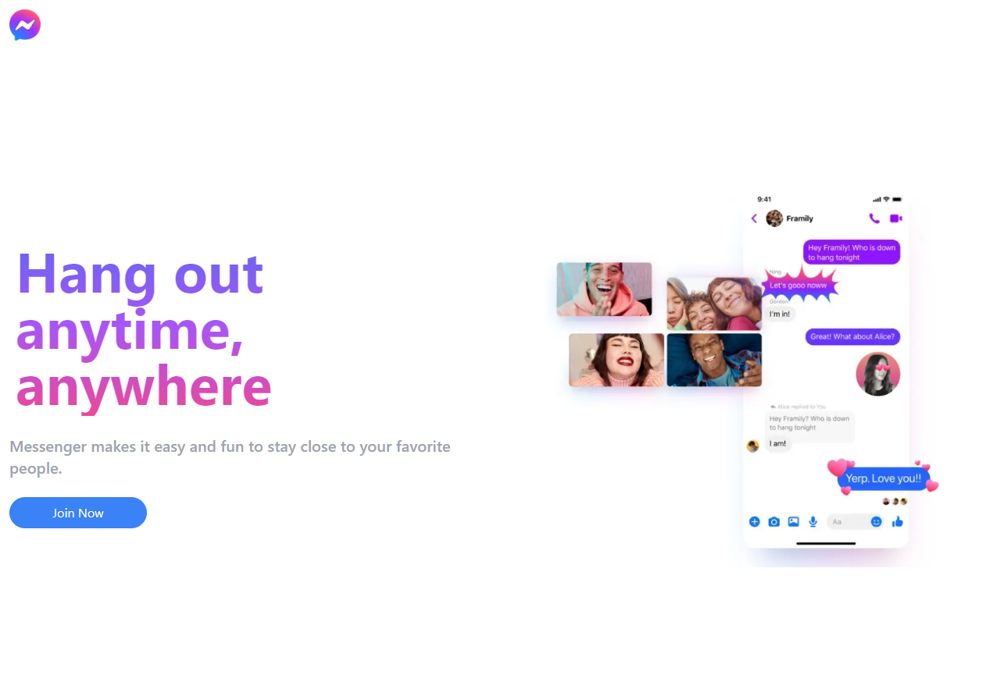
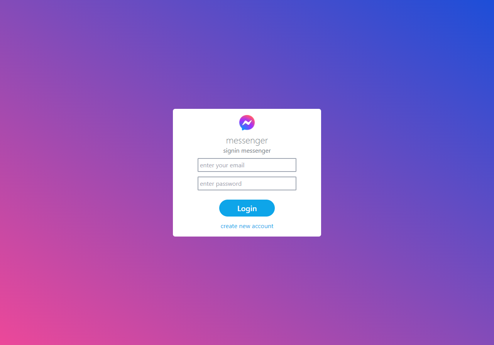
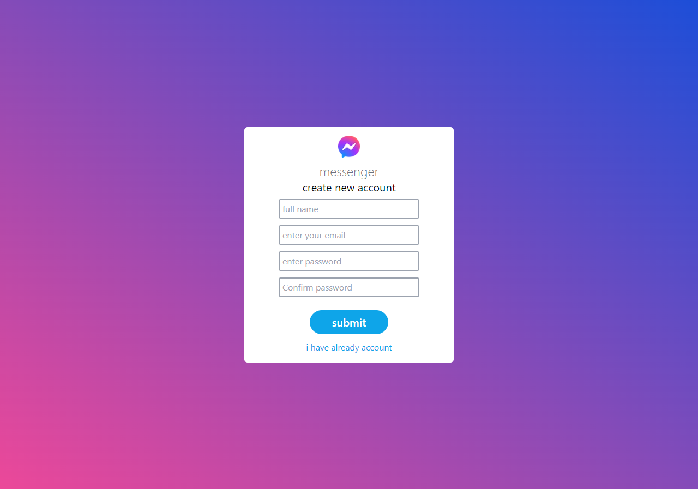

# 💬 Messenger Clone

A real-time messaging web application inspired by modern chat platforms, built to demonstrate full-stack development skills including authentication, real-time communication, and responsive UI design.

## 📸 Preview
### home page

### log in page

### sign up page

Chat interface
Conversations list
Online users indicator
🧠 Features
🔐 User authentication (Login / Register)
💬 Real-time messaging between users
🟢 Online / Offline user status
📂 Conversation management
🔔 Live message updates (WebSockets / Socket.io)
📱 Responsive UI (Mobile + Desktop)
🧾 Message history persistence
🛠️ Tech Stack
## Frontend
- React.js
- Tailwind CSS
- Socket.io Client
## Backend
- Node.js
- Express.js
- Socket.io
- Database
- MongoDB 
- Authentication
- JWT (JSON Web Token)
- bcrypt for password hashing

## 🧠 What I Learned
- Building real-time systems with Socket.io
- Handling authentication securely with JWT
- Structuring scalable full-stack applications
- Managing state in real-time UI
